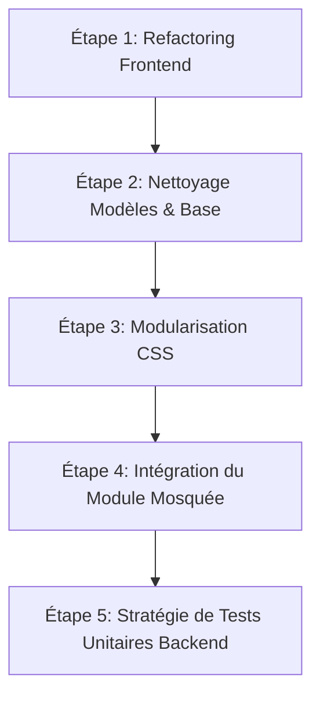

# Audit Technique In-Extenso : Projet GestSchool V2

Ce rapport présente un audit approfondi et rigoureux du projet **GestSchool V2**, réalisé sous l'angle d'un architecte logiciel sénior. Il met en lumière les forces architecturales, les dettes techniques majeures (front et back), les incohérences de modèles, les fonctionnalités manquantes et le code mort.

---

## 1. Synthèse Executive de l'Architecture

GestSchool V2 est structuré sous forme de **monolithe modulaire** organisé dans un monorepo géré avec **pnpm**. 

### La Pile Technologique actuelle :
*   **Backend** : NestJS (v11), TypeScript, Prisma ORM, PostgreSQL (16), et Redis (7) pour la mise en cache distribuée et la limitation de débit (rate-limiting).
*   **Frontend** : React (v18) + Vite, avec compilation TypeScript autonome. Le design visuel et le style reposent exclusivement sur des couches de CSS natif (Vanilla CSS, pas de Tailwind).
*   **DevOps / Infrastructure** : Fichiers de configuration Kubernetes (`k8s/`), environnement local conteneurisé (`docker-compose.dev.yml`), et scripts de déploiement multi-cibles (Render.yaml, Vercel.json).

---

## 2. Audit du Backend (API et Worker)

La conception du backend NestJS démontre une bonne maturité. Les principes d'injection de dépendances et la modularité par domaine (`students/`, `teachers/`, `finance/`, etc.) sont bien respectés.

### 2.1. Points Forts de Conception
1.  **Découplage transactionnel (Outbox Pattern)** : La présence d'une table `OutboxEvent` couplée à un processeur asynchrone permet un découplage efficace entre l'écriture en base de données et les effets de bord (audit logs, envois de notifications). C'est un excellent choix de robustesse architecturale.
2.  **Gestion de la multi-location (Multi-Tenancy)** : L'extraction et la validation rigoureuse de l'en-tête `x-tenant-id` (via `resolveTenantContext` et `resolveTenantId` dans `common/`) garantissent l'isolation logique des données.
3.  **Fournisseurs d'intégration abstraits** : L'envoi de SMS/Email (via Brevo avec SMS dry-run) et la gestion de stockage (locale vs Supabase Storage) sont isolés derrière des adaptateurs génériques (`storage-provider.ts`, `notification-gateway.service.ts`), facilitant les changements de fournisseurs.

### 2.2. Points d'Attention & Zones Chaudes (Hotspots)
1.  **`NotificationsService` dense** : Ce service gère à la fois le cycle de vie de création, l'agrégation des adresses cibles, la publication, le statut d'envoi et la journalisation des erreurs. Il concentre trop de responsabilités.
2.  **`FinanceService` surchargé** : Il englobe la facturation interne, l'établissement des plans financiers, l'historique comptable et l'IPN de PayDunya.
3.  **`AcademicStructureService` complexe** : Responsable des placements d'élèves, de la hiérarchie et de l'orchestration des règles pédagogiques. Bien que la validation des règles ait été extraite dans un validateur externe (`AcademicStructureRuleValidator`), ce service reste très dense.

---

## 3. Audit du Frontend (Web Admin)

Le frontend React compile parfaitement, mais il concentre les dettes techniques les plus critiques du projet.

### 3.1. Le Monolithe Applicatif `App.tsx` (1 838 lignes)
Le composant racine `App` est un anti-pattern flagrant d'architecture React :
*   **Centralisation excessive de l'état** : Tout l'état applicatif de tous les modules métiers (`students`, `schoolYears`, `enrollments`, `feePlans`, `invoices`, `payments`, `reportCards`, `teacherGrades`, `parentRecords`, etc.) est stocké dans le composant racine `App.tsx`.
*   **Prop-drilling et couplage** : En l'absence de gestionnaire d'état global (comme Zustand, Redux ou simplement un React Context partitionné), les données et les fonctions de rappel (Callbacks d'API) sont passées de manière transitive à travers de multiples composants.
*   **Couplage d'authentification** : Les formulaires de connexion, de récupération de mot de passe et d'activation de compte partagent le même fichier et le même cycle de vie que le squelette applicatif global.
*   **Performance** : Tout changement d'état mineur (comme l'ouverture d'un menu mobile ou la modification d'un filtre) déclenche des recalculs et des re-rendus sur l'arbre entier de l'application.

### 3.2. Surcharge de CSS Vanilla (Plus de 300 Ko)
Le projet utilise du CSS natif réparti dans des dizaines de fichiers, dont certains sont disproportionnés (`erp-refinement.css` à 76 Ko, `features.css` à 79 Ko).
*   **Risques de collisions de cascades CSS** : L'absence de modules CSS ou de bibliothèque de composants isolés fait reposer l'affichage sur des sélecteurs globaux très fragiles.
*   **Maintenance** : Identifier et éliminer les règles CSS mortes est extrêmement complexe à ce stade.

---

## 4. Code Mort, Redondances et Incohérences (Doublons)

Une analyse minutieuse a révélé plusieurs éléments de code inutilisés ou redondants.

### 4.1. Table et Modèle Prisma Orphelins : `TeacherClassAssignment`
*   **Le constat** : Le schéma Prisma contient un modèle `TeacherClassAssignment` (lignes 775-792 dans `schema.prisma`), qui dispose d'une table PostgreSQL physique. 
*   **Code Mort** : Cette table n'est **jamais référencée** dans le code actif de l'API backend (`Backend/api/src/`), qui utilise exclusivement le modèle `TeacherAssignment` pour gérer les affectations d'enseignants.
*   **Présence résiduelle** : Elle n'apparaît que dans les scripts de diagnostic d'ancienne base de données (`legacy-inventory.ts` et `precutover-db-audit.ts`) pour comptabiliser les résidus historiques de la V1. C'est une dette de modèle à purger.

### 4.2. Double stockage dans `TimetableSlot` (Champs Texte vs Relations)
*   **Le constat** : Les créneaux d'emploi du temps (`TimetableSlot`) stockent à la fois :
    *   Les chaînes de caractères brutes d'origine (`room` et `teacherName`).
    *   Les clés étrangères normalisées (`roomId` et `teacherAssignmentId`).
*   **Incohérence** : Durant les phases de transition, des dérives d'intégrité peuvent survenir si les données textuelles et relationnelles ne sont pas synchronisées. Les écritures actives de l'API doivent bannir l'usage des chaînes de caractères brutes.

### 4.3. Flou structurel : `Enrollment` vs `StudentTrackPlacement`
*   Le modèle `Enrollment` (inscription) coexiste avec le modèle `StudentTrackPlacement` (placement académique par cursus). Le premier ne sert plus que de trace administrative et de compatibilité historique, tandis que le second porte la vérité académique. Cette double structure complique les requêtes de reporting.

---

## 5. Fonctionnalités Manquantes (Les Manques)

L'audit révèle des asymétries majeures entre les capacités déclarées du backend et le produit final frontend.

### 5.1. Le Module Mosquée (Mosquée, Dons et Activités)
*   **Backend** : Entièrement développé et fonctionnel. Le contrôleur `MosqueeController` et le service `MosqueeService` implémentent le suivi des dons, la génération de reçus PDF, l'exportation Excel/PDF des membres et des activités, avec gestion des permissions métiers.
*   **Frontend** : Le module est réduit à un seul écran contenant une page de construction statique (`ConstructionPageMosquee` dans `features/mosquee/construction-page.tsx`). L'utilisateur final ne peut pas accéder à l'API mosquée depuis l'interface d'administration.

### 5.2. L'Application Mobile (`Frontend/mobile`)
*   Le dossier `Frontend/mobile` ne contient qu'un fichier `README.md` indiquant que c'est un emplacement réservé pour de futurs développements. Aucun code de client mobile n'existe actuellement.

### 5.3. Le Portail Élève
*   Les portails Parent et Enseignant disposent de flux de données réels, mais le portail Élève est un simple écran de démonstration non implémenté (absence d'IAM élève, de vues d'emploi du temps dédiées, etc.).

---

## 6. Déficit de Couverture de Tests Backend

L'approche de test des deux projets est asymétrique :
*   **Frontend** : Excellente couverture de tests unitaires (54 tests unitaires complets écrits avec Vitest et `@testing-library/react` qui passent tous avec succès).
*   **Backend** : **Aucun test unitaire** n'est présent dans le répertoire source `Backend/api/src/`. L'intégralité de l'assurance qualité repose sur des tests de bout en bout (E2E) dans le répertoire `test/`.
*   **Conséquence** : Cela ralentit fortement les boucles de rétroaction en intégration continue (CI) car chaque lancement de test nécessite la création, le peuplement et la suppression d'une base de données PostgreSQL de test physique (via `run-e2e-db-sequence.cjs`).

---

## 7. Plan de Remédiation & Recommandations Architecturales

Pour amener le projet GestSchool V2 à un niveau industriel, voici les étapes recommandées, ordonnées par priorité :

### Étape 1 : Refactoring de l'état Frontend et démantèlement de `App.tsx` (Priorité Haute)
1.  **Introduire Zustand** (ou React Context de manière ciblée) pour stocker les référentiels de données (`students`, `classes`, `schoolYears`) et libérer `App.tsx` de sa charge de variables d'état.
2.  **Découper l'authentification** : Extraire les formulaires et les hooks d'authentification (`AuthScreen`, `ForgotPassword`, `FirstConnection`) hors du flux de rendu principal de la coquille administrative.
3.  **Implémenter un routeur déclaratif** (ex: *React Router* ou *TanStack Router*) au lieu de basculer manuellement des états de chaînes de caractères (`tab === 'dashboard'`).

### Étape 2 : Nettoyage des modèles de base de données (Priorité Moyenne)
1.  **Supprimer `TeacherClassAssignment`** du schéma Prisma, générer une migration SQL pour supprimer la table PostgreSQL devenue inutile et nettoyer les scripts d'audit de cette référence.
2.  **Imposer l'usage de clés étrangères pour les salles/enseignants** dans le validateur d'emploi du temps, puis planifier une migration de données pour transformer les colonnes textuelles en données calculées non modifiables à des fins d'historique.

### Étape 3 : Structuration CSS (Priorité Moyenne)
1.  Introduire les **CSS Modules** pour associer chaque style CSS à son composant React associé. Cela évitera les fuites de règles de style et réduira la taille des fichiers CSS globaux.

### Étape 4 : Connexion des composants Frontend de la Mosquée (Priorité Basse)
1.  Remplacer `ConstructionPageMosquee` par des écrans réels de gestion (dons, membres, activités) en consommant les points de terminaison REST déjà exposés par le backend NestJS.

### Étape 5 : Stratégie de tests unitaires backend (Priorité Basse)
1.  Introduire des tests unitaires NestJS en utilisant Jest (déjà installé) avec des simulacres (mocks) de `PrismaService` pour tester les validateurs métiers (ex: `AcademicStructureRuleValidator`) sans dépendance à une base PostgreSQL active.
