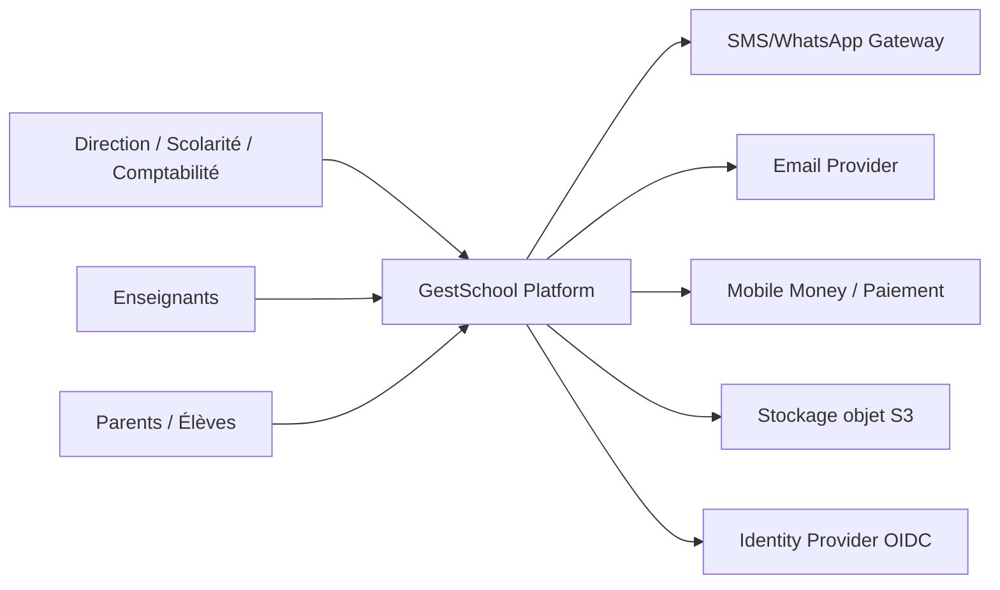
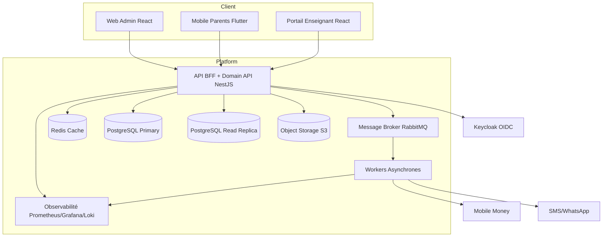
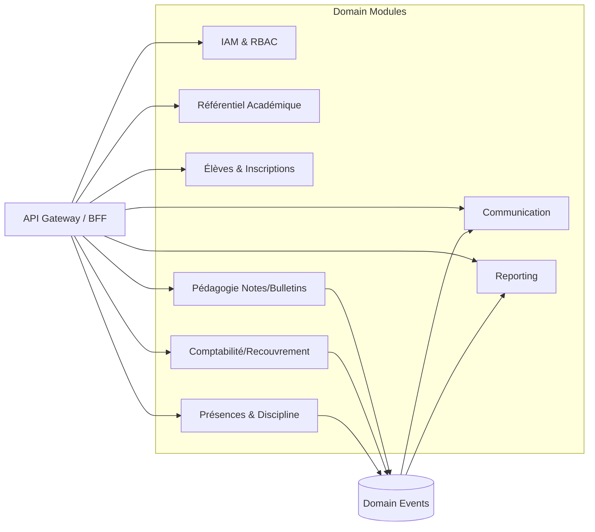

# Proposition 1 - Architecture prête à implémenter

## 1. Schéma d’architecture C4

### C4 - Niveau 1 (System Context)


### C4 - Niveau 2 (Containers)


### C4 - Niveau 3 (Composants internes de l’API)


### Principes d’implémentation immédiats
- Démarrage en modular monolith strict (modules isolés, contrats explicites).
- Event-driven interne via broker pour traitements lourds (reçus, notifications, exports).
- PostgreSQL transactionnel pour le coeur métier, Redis pour cache/session.
- API versionnée (`/api/v1`) + OpenAPI obligatoire.
- Multi-tenant léger prêt pour extension multi-campus (`tenant_id` partout).

### NFR (cibles v1)
- Disponibilité API: 99.9%.
- P95 lecture < 300 ms, P95 écriture < 500 ms.
- RPO <= 15 min, RTO <= 60 min.
- Audit complet: notes, paiements, changements de rôles.

---

## 2. Modèle de données PostgreSQL v1 (tables clés)

### Conventions
- Toutes les tables métier: `id UUID PK`, `tenant_id UUID`, `created_at`, `updated_at`.
- Montants en `NUMERIC(14,2)`, jamais en float.
- `deleted_at` pour soft delete sur entités sensibles.

### DDL de base (noyau)
```sql
-- Extensions
CREATE EXTENSION IF NOT EXISTS "pgcrypto";

-- 1) Référentiel
CREATE TABLE school_years (
  id UUID PRIMARY KEY DEFAULT gen_random_uuid(),
  tenant_id UUID NOT NULL,
  code VARCHAR(20) NOT NULL,        -- ex: 2026-2027
  start_date DATE NOT NULL,
  end_date DATE NOT NULL,
  is_active BOOLEAN NOT NULL DEFAULT FALSE,
  created_at TIMESTAMPTZ NOT NULL DEFAULT now(),
  updated_at TIMESTAMPTZ NOT NULL DEFAULT now(),
  UNIQUE (tenant_id, code)
);

CREATE TABLE cycles (
  id UUID PRIMARY KEY DEFAULT gen_random_uuid(),
  tenant_id UUID NOT NULL,
  code VARCHAR(20) NOT NULL,        -- PRIMARY, COLLEGE, LYCEE, SUPERIEUR
  label VARCHAR(100) NOT NULL,
  sort_order INT NOT NULL,
  created_at TIMESTAMPTZ NOT NULL DEFAULT now(),
  updated_at TIMESTAMPTZ NOT NULL DEFAULT now(),
  UNIQUE (tenant_id, code)
);

CREATE TABLE levels (
  id UUID PRIMARY KEY DEFAULT gen_random_uuid(),
  tenant_id UUID NOT NULL,
  cycle_id UUID NOT NULL REFERENCES cycles(id),
  code VARCHAR(20) NOT NULL,        -- CP1 ... M2
  label VARCHAR(100) NOT NULL,
  sort_order INT NOT NULL,
  created_at TIMESTAMPTZ NOT NULL DEFAULT now(),
  updated_at TIMESTAMPTZ NOT NULL DEFAULT now(),
  UNIQUE (tenant_id, code)
);

CREATE TABLE classes (
  id UUID PRIMARY KEY DEFAULT gen_random_uuid(),
  tenant_id UUID NOT NULL,
  school_year_id UUID NOT NULL REFERENCES school_years(id),
  level_id UUID NOT NULL REFERENCES levels(id),
  code VARCHAR(30) NOT NULL,        -- ex: CP1-A
  label VARCHAR(100) NOT NULL,
  capacity INT,
  created_at TIMESTAMPTZ NOT NULL DEFAULT now(),
  updated_at TIMESTAMPTZ NOT NULL DEFAULT now(),
  UNIQUE (tenant_id, school_year_id, code)
);

CREATE TABLE subjects (
  id UUID PRIMARY KEY DEFAULT gen_random_uuid(),
  tenant_id UUID NOT NULL,
  code VARCHAR(20) NOT NULL,
  label VARCHAR(120) NOT NULL,
  is_arabic BOOLEAN NOT NULL DEFAULT FALSE,
  created_at TIMESTAMPTZ NOT NULL DEFAULT now(),
  updated_at TIMESTAMPTZ NOT NULL DEFAULT now(),
  UNIQUE (tenant_id, code)
);

CREATE TABLE class_subjects (
  id UUID PRIMARY KEY DEFAULT gen_random_uuid(),
  tenant_id UUID NOT NULL,
  class_id UUID NOT NULL REFERENCES classes(id),
  subject_id UUID NOT NULL REFERENCES subjects(id),
  coefficient NUMERIC(5,2) NOT NULL DEFAULT 1,
  max_score NUMERIC(5,2) NOT NULL DEFAULT 20,
  created_at TIMESTAMPTZ NOT NULL DEFAULT now(),
  updated_at TIMESTAMPTZ NOT NULL DEFAULT now(),
  UNIQUE (tenant_id, class_id, subject_id)
);

CREATE TABLE academic_periods (
  id UUID PRIMARY KEY DEFAULT gen_random_uuid(),
  tenant_id UUID NOT NULL,
  school_year_id UUID NOT NULL REFERENCES school_years(id),
  code VARCHAR(20) NOT NULL,        -- T1, T2, S1...
  label VARCHAR(100) NOT NULL,
  start_date DATE NOT NULL,
  end_date DATE NOT NULL,
  period_type VARCHAR(20) NOT NULL, -- TRIMESTER/SEMESTER
  created_at TIMESTAMPTZ NOT NULL DEFAULT now(),
  updated_at TIMESTAMPTZ NOT NULL DEFAULT now(),
  UNIQUE (tenant_id, school_year_id, code)
);

-- 2) Identité / acteurs
CREATE TABLE students (
  id UUID PRIMARY KEY DEFAULT gen_random_uuid(),
  tenant_id UUID NOT NULL,
  matricule VARCHAR(30) NOT NULL,
  first_name VARCHAR(100) NOT NULL,
  last_name VARCHAR(100) NOT NULL,
  sex CHAR(1) NOT NULL CHECK (sex IN ('M', 'F')),
  birth_date DATE,
  birth_place VARCHAR(120),
  nationality VARCHAR(80),
  address TEXT,
  phone VARCHAR(30),
  email VARCHAR(120),
  photo_url TEXT,
  status VARCHAR(20) NOT NULL DEFAULT 'ACTIVE',
  created_at TIMESTAMPTZ NOT NULL DEFAULT now(),
  updated_at TIMESTAMPTZ NOT NULL DEFAULT now(),
  deleted_at TIMESTAMPTZ,
  UNIQUE (tenant_id, matricule)
);

CREATE TABLE guardians (
  id UUID PRIMARY KEY DEFAULT gen_random_uuid(),
  tenant_id UUID NOT NULL,
  first_name VARCHAR(100) NOT NULL,
  last_name VARCHAR(100) NOT NULL,
  relation_type VARCHAR(30) NOT NULL, -- PERE, MERE, TUTEUR
  phone VARCHAR(30),
  email VARCHAR(120),
  address TEXT,
  created_at TIMESTAMPTZ NOT NULL DEFAULT now(),
  updated_at TIMESTAMPTZ NOT NULL DEFAULT now()
);

CREATE TABLE student_guardians (
  id UUID PRIMARY KEY DEFAULT gen_random_uuid(),
  tenant_id UUID NOT NULL,
  student_id UUID NOT NULL REFERENCES students(id),
  guardian_id UUID NOT NULL REFERENCES guardians(id),
  is_primary BOOLEAN NOT NULL DEFAULT FALSE,
  created_at TIMESTAMPTZ NOT NULL DEFAULT now(),
  updated_at TIMESTAMPTZ NOT NULL DEFAULT now(),
  UNIQUE (tenant_id, student_id, guardian_id)
);

CREATE TABLE enrollments (
  id UUID PRIMARY KEY DEFAULT gen_random_uuid(),
  tenant_id UUID NOT NULL,
  school_year_id UUID NOT NULL REFERENCES school_years(id),
  student_id UUID NOT NULL REFERENCES students(id),
  class_id UUID NOT NULL REFERENCES classes(id),
  enrollment_date DATE NOT NULL,
  enrollment_status VARCHAR(20) NOT NULL DEFAULT 'ENROLLED',
  created_at TIMESTAMPTZ NOT NULL DEFAULT now(),
  updated_at TIMESTAMPTZ NOT NULL DEFAULT now(),
  UNIQUE (tenant_id, school_year_id, student_id)
);

-- 3) Pédagogie
CREATE TABLE assessments (
  id UUID PRIMARY KEY DEFAULT gen_random_uuid(),
  tenant_id UUID NOT NULL,
  class_subject_id UUID NOT NULL REFERENCES class_subjects(id),
  period_id UUID NOT NULL REFERENCES academic_periods(id),
  title VARCHAR(120) NOT NULL,
  assessment_type VARCHAR(30) NOT NULL, -- DEVOIR, COMPOSITION...
  score_max NUMERIC(5,2) NOT NULL DEFAULT 20,
  assessment_date DATE NOT NULL,
  created_by UUID,
  created_at TIMESTAMPTZ NOT NULL DEFAULT now(),
  updated_at TIMESTAMPTZ NOT NULL DEFAULT now()
);

CREATE TABLE grades (
  id UUID PRIMARY KEY DEFAULT gen_random_uuid(),
  tenant_id UUID NOT NULL,
  assessment_id UUID NOT NULL REFERENCES assessments(id),
  student_id UUID NOT NULL REFERENCES students(id),
  score NUMERIC(5,2) NOT NULL,
  absent BOOLEAN NOT NULL DEFAULT FALSE,
  comment TEXT,
  created_at TIMESTAMPTZ NOT NULL DEFAULT now(),
  updated_at TIMESTAMPTZ NOT NULL DEFAULT now(),
  UNIQUE (tenant_id, assessment_id, student_id)
);

CREATE TABLE report_cards (
  id UUID PRIMARY KEY DEFAULT gen_random_uuid(),
  tenant_id UUID NOT NULL,
  student_id UUID NOT NULL REFERENCES students(id),
  class_id UUID NOT NULL REFERENCES classes(id),
  period_id UUID NOT NULL REFERENCES academic_periods(id),
  avg_general NUMERIC(6,3) NOT NULL,
  class_rank INT,
  conduct VARCHAR(30),
  appreciation VARCHAR(40),
  pdf_url TEXT,
  published_at TIMESTAMPTZ,
  created_at TIMESTAMPTZ NOT NULL DEFAULT now(),
  updated_at TIMESTAMPTZ NOT NULL DEFAULT now(),
  UNIQUE (tenant_id, student_id, class_id, period_id)
);

-- 4) Comptabilité
CREATE TABLE fee_plans (
  id UUID PRIMARY KEY DEFAULT gen_random_uuid(),
  tenant_id UUID NOT NULL,
  school_year_id UUID NOT NULL REFERENCES school_years(id),
  level_id UUID NOT NULL REFERENCES levels(id),
  label VARCHAR(120) NOT NULL,
  total_amount NUMERIC(14,2) NOT NULL,
currency CHAR(3) NOT NULL DEFAULT 'CFA',
  created_at TIMESTAMPTZ NOT NULL DEFAULT now(),
  updated_at TIMESTAMPTZ NOT NULL DEFAULT now(),
  UNIQUE (tenant_id, school_year_id, level_id, label)
);

CREATE TABLE invoices (
  id UUID PRIMARY KEY DEFAULT gen_random_uuid(),
  tenant_id UUID NOT NULL,
  student_id UUID NOT NULL REFERENCES students(id),
  school_year_id UUID NOT NULL REFERENCES school_years(id),
  fee_plan_id UUID REFERENCES fee_plans(id),
  invoice_no VARCHAR(40) NOT NULL,
  amount_due NUMERIC(14,2) NOT NULL,
  amount_paid NUMERIC(14,2) NOT NULL DEFAULT 0,
  status VARCHAR(20) NOT NULL DEFAULT 'OPEN', -- OPEN/PARTIAL/PAID/VOID
  due_date DATE,
  created_at TIMESTAMPTZ NOT NULL DEFAULT now(),
  updated_at TIMESTAMPTZ NOT NULL DEFAULT now(),
  UNIQUE (tenant_id, invoice_no)
);

CREATE TABLE payments (
  id UUID PRIMARY KEY DEFAULT gen_random_uuid(),
  tenant_id UUID NOT NULL,
  invoice_id UUID NOT NULL REFERENCES invoices(id),
  receipt_no VARCHAR(40) NOT NULL,
  paid_amount NUMERIC(14,2) NOT NULL,
  payment_method VARCHAR(30) NOT NULL, -- CASH, MOBILE_MONEY, BANK
  paid_at TIMESTAMPTZ NOT NULL,
  reference_external VARCHAR(120),
  received_by UUID,
  created_at TIMESTAMPTZ NOT NULL DEFAULT now(),
  updated_at TIMESTAMPTZ NOT NULL DEFAULT now(),
  UNIQUE (tenant_id, receipt_no)
);

-- 5) Présence
CREATE TABLE attendance_sessions (
  id UUID PRIMARY KEY DEFAULT gen_random_uuid(),
  tenant_id UUID NOT NULL,
  class_id UUID NOT NULL REFERENCES classes(id),
  period_id UUID REFERENCES academic_periods(id),
  session_date DATE NOT NULL,
  slot VARCHAR(20) NOT NULL, -- MORNING/AFTERNOON
  created_by UUID,
  created_at TIMESTAMPTZ NOT NULL DEFAULT now(),
  updated_at TIMESTAMPTZ NOT NULL DEFAULT now(),
  UNIQUE (tenant_id, class_id, session_date, slot)
);

CREATE TABLE attendance_records (
  id UUID PRIMARY KEY DEFAULT gen_random_uuid(),
  tenant_id UUID NOT NULL,
  session_id UUID NOT NULL REFERENCES attendance_sessions(id),
  student_id UUID NOT NULL REFERENCES students(id),
  status VARCHAR(20) NOT NULL, -- PRESENT, ABSENT, LATE, EXCUSED
  reason TEXT,
  created_at TIMESTAMPTZ NOT NULL DEFAULT now(),
  updated_at TIMESTAMPTZ NOT NULL DEFAULT now(),
  UNIQUE (tenant_id, session_id, student_id)
);

-- 6) Audit minimal
CREATE TABLE audit_logs (
  id UUID PRIMARY KEY DEFAULT gen_random_uuid(),
  tenant_id UUID NOT NULL,
  actor_id UUID,
  actor_role VARCHAR(50),
  action VARCHAR(100) NOT NULL,
  entity_type VARCHAR(80) NOT NULL,
  entity_id UUID,
  metadata JSONB,
  created_at TIMESTAMPTZ NOT NULL DEFAULT now()
);

-- Indexes critiques
CREATE INDEX idx_students_tenant_matricule ON students(tenant_id, matricule);
CREATE INDEX idx_enrollments_tenant_year_class ON enrollments(tenant_id, school_year_id, class_id);
CREATE INDEX idx_grades_tenant_assessment ON grades(tenant_id, assessment_id);
CREATE INDEX idx_invoices_tenant_student_status ON invoices(tenant_id, student_id, status);
CREATE INDEX idx_payments_tenant_paid_at ON payments(tenant_id, paid_at DESC);
CREATE INDEX idx_audit_logs_tenant_created ON audit_logs(tenant_id, created_at DESC);
```

### Règles métier clés à implémenter au niveau DB + service
- Contrainte: un élève ne peut avoir qu’une seule inscription active par année scolaire.
- Contrainte: `invoices.amount_paid <= invoices.amount_due`.
- Transaction obligatoire lors d’un paiement: insert payment + update invoice atomique.
- Publication bulletin uniquement si toutes les notes requises de la période existent.

---

## 3. Backlog produit priorisé (EPICs + user stories)

## Priorité P0 - MVP lancement

### EPIC 1 - IAM et sécurité
- US1: En tant qu’admin, je crée des comptes avec rôles (direction, enseignant, comptable, parent) pour contrôler les accès.
  - AC: refus d’accès aux routes non autorisées; journalisation des connexions.
- US2: En tant qu’utilisateur sensible, j’active MFA pour sécuriser mon compte.
  - AC: second facteur requis pour direction/compta.

### EPIC 2 - Référentiel académique
- US3: En tant que scolarité, je configure année, cycles, niveaux, classes, matières et coefficients.
  - AC: validation des codes uniques; import CSV possible.
- US4: En tant que direction, je définis les périodes (trimestres/semestres).
  - AC: pas de chevauchement de dates dans une même année.

### EPIC 3 - Élèves et inscriptions
- US5: En tant que scolarité, j’enregistre un élève et ses tuteurs.
  - AC: matricule unique; fiche complète consultable.
- US6: En tant que scolarité, j’inscris l’élève dans une classe pour une année.
  - AC: une seule inscription active par année; historique conservé.

### EPIC 4 - Notes et bulletins
- US7: En tant qu’enseignant, je saisis les notes par classe/matière/période.
  - AC: saisie en lot; validations bareme; autosave brouillon.
- US8: En tant que direction, je publie les bulletins après contrôle.
  - AC: calcul moyenne/rang exact; PDF généré et archivé.

### EPIC 5 - Comptabilité et encaissements
- US9: En tant que comptable, je crée les frais scolaires par niveau.
  - AC: génération des factures élèves à l’inscription.
- US10: En tant que comptable, j’enregistre un paiement et j’édite un reçu.
  - AC: numéro reçu unique; mise à jour instantanée du reste dû.
- US11: En tant que direction, je vois recouvrement et impayés en dashboard.
  - AC: KPI par classe, niveau, période.

## Priorité P1 - Stabilisation

### EPIC 6 - Présences et discipline
- US12: En tant qu’enseignant, je fais l’appel quotidien.
  - AC: statut présent/absent/retard; export mensuel.
- US13: En tant que parent, je suis notifié en cas d’absence.
  - AC: notification SMS en moins de 5 minutes.

### EPIC 7 - Communication
- US14: En tant qu’admin, j’envoie des annonces ciblées (classe/niveau).
  - AC: canaux SMS/email; suivi de délivrabilité.

## Priorité P2 - Extension

### EPIC 8 - Mobile parents/élèves
- US15: En tant que parent, je consulte notes, absences, solde et bulletins sur mobile.
  - AC: mode faible réseau; synchronisation robuste.

### EPIC 9 - Module Mosquée (phase ultérieure)
- US16: En tant qu’administration, je gère membres, dons et activités de la mosquée dans un module séparé.
  - AC: IAM mutualisé; données isolées du scolaire par domaine.

---

## 4. Roadmap d’implémentation (12 semaines)
- S1-S2: IAM, référentiel, base PostgreSQL, CI/CD.
- S3-S5: élèves/inscriptions, frais/factures, encaissements.
- S6-S8: notes, calcul moyennes/rangs, génération bulletins.
- S9-S10: dashboard KPI, audit, observabilité.
- S11-S12: hardening sécurité, tests de charge, préparation production.

## 5. Définition de Done technique
- Tests unitaires >= 70% sur modules coeur (finance, notes).
- Tests d’intégration sur flux critiques (paiement, bulletin).
- Migration DB versionnée (`Flyway` ou `Prisma Migrate`).
- SLO monitorés en production avec alertes.
- Revue sécurité (RBAC, MFA, audit trail) validée.
